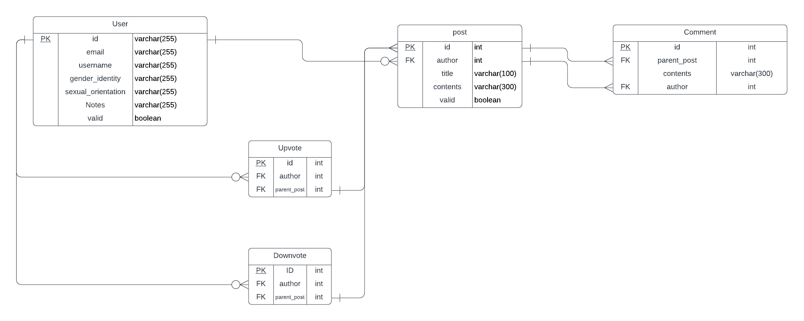
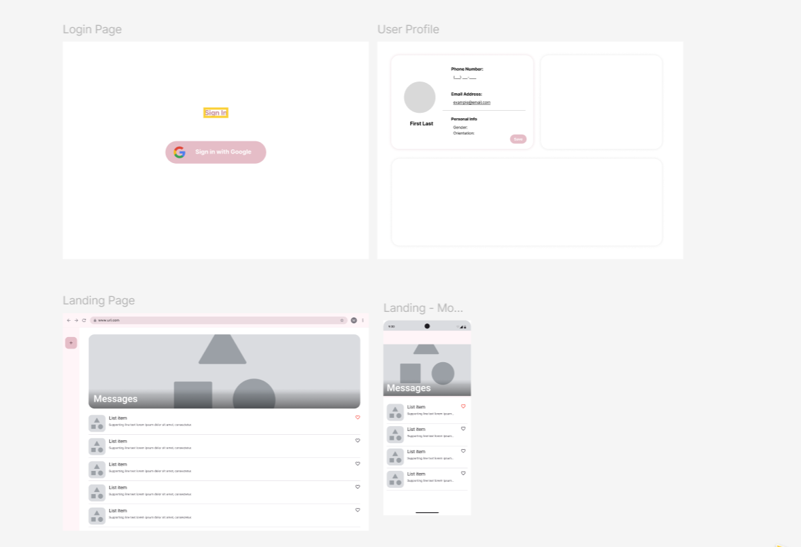
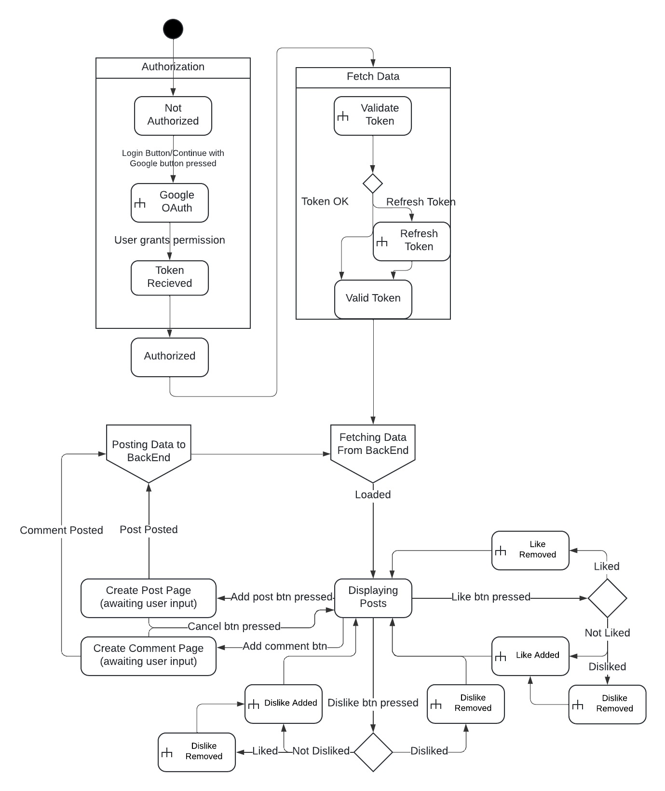

# [User Stories](phase-2/Phase-02-Sprint-08-Team_Jailbreak-User-Stories.txt)

# Architecture Diagram
### (Unchanged from Phase 1)

# Database ER Diagram

# UI Mockup

# UML State Diagram/State Machine for User Interaction

# UML State Diagram/State Machine for Idea Object

# API Routes

