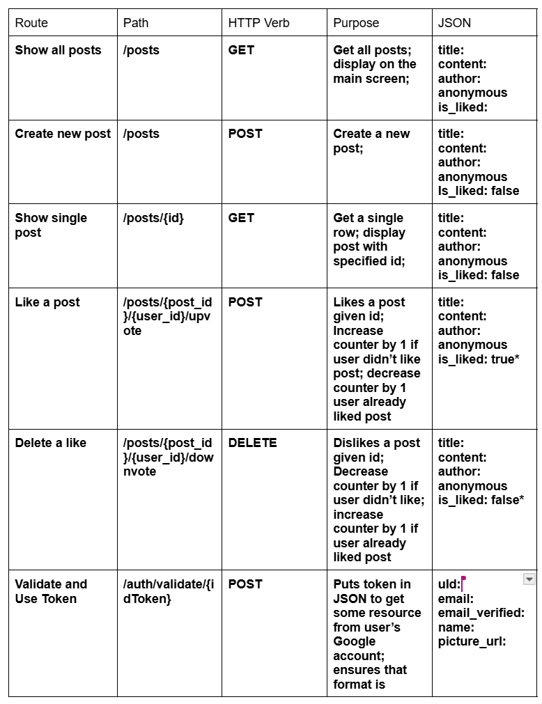
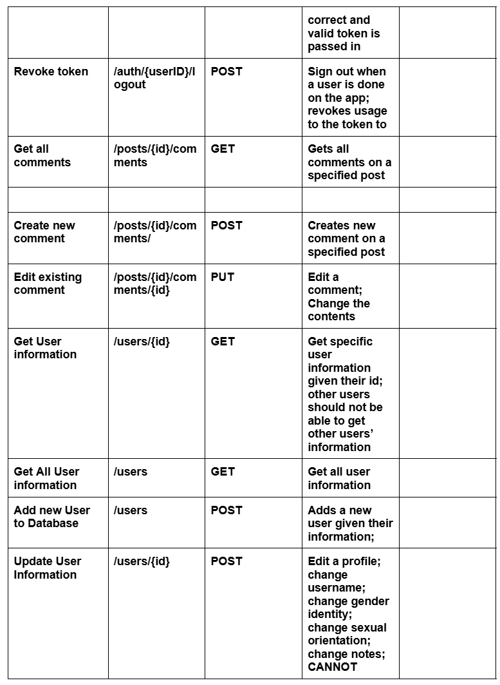

# Phase 2 Prime Sprint 10 - PM Report

* Number: 32 
* Name: Jailbreak
* Mentor: Emir Veziroglu, env225@lehigh.edu
* Weekly live & synchronous meeting: 
    * without mentor: Thursday (11/07) @ 4:30 PM
    * with mentor: Tuesday (11/12) @ 7:15 pm

### Team Roles:

* Project Manger: <Dean Clark, dmc227@lehigh.edu>
* Backend developer: <Illia Slipchenko, ils226@lehigh.edu>
* Admin developer: <Liam Messinger, ljm426@lehigh.edu>
* Web developer: <Anaya Rawoot, adr325@lehigh.edu>
* Mobile developer: <Jared Cooper, jac327@lehigh.edu>

### Essential links for this project:

* Team's Dokku URL(s)
    * <https://team-jailbreak.dokku.cse.lehigh.edu>
* Team's software repo (bitbucket)
    * <https://bitbucket.org/sml3/cse216_fa24_team_32>
* Team's Jira board
    * <https://lehigh-team-drfppe9i.atlassian.net/jira/software/projects/TC/boards/2>

## Beginning of Phase 2'

1. What required Phase 2 functionality was not implemented and why? 

    * <b>Admin-cli</b>
        1. Missing functionality from phase 1: None 
        2. Missing functionality from phase 2: None

    * <b>Backend</b>
        1. Missing functionality from phase 1: Adding JavaDoc documentation instead of just README. 
        2. Missing functionality from phase 2: Since our frontends are not working, I am not defniitively sure if everything is working, but from our code review, I think the only thing we are missing is checking to see that all the routes work as expected with the backend, but in Postman the proper JSON was being sent over from all the routes that are in our API routes doc. Maybe adding some more tests, documentation, and refactoring but the core functionality works.

    * <b>Mobile Frontend</b>
        1. Missing functionality from phase 1: None
        2. Missing functionality from phase 2: Right now, the Google authentification does not lead anywhere after the authorization route, I think it has something to do with the API client ID. Additionally, I don't think the profile page is updating information and may not be accessible at all.
    * <b>Web Frontend</b>
        1. Missing functionality from phase 1: None
        2. Missing functionality from phase 2: Right now, the Google authentification does not lead anywhere after the authorization route, I think it has something to do with the API client ID. Additionally, I don't think the profile page is updating information and may not be accessible at all.

2. What technical debt did the team accrue during Phase 2?
    * <b>Admin-cli</b>
        * None, everything was taken care of during this phase
    * <b>Backend</b>
        * Documentaiton, refactoring, and writing a few more good working tests. 
    * <b>Mobile Frontend</b>
        * Google authentification/redirecting from Google, profile id getting/updating, documentation, testing.
    * <b>Web Frontend</b>
        * Google authentification/redirecting from Google, profile id getting/updating, documentation, testing.

## End of Phase 2'
<b>Report out on the Phase 2' backlog as it stands at the conclusion of Phase 2'.</b>

For the most part, the "backend"-y stuff (backend and Admin) are all working. They have enough documentation and tests to prove that most things work, whereas the "frontend"-y stuff (frontend and mobile) still have some issues to iron out. Mainly, there were issues with the final step of authentication, profile routes, and that whole part of OAuth. Documentation and unit tests are also sort of lacking becasuse of that, since they are not entirely finished. Moving forward, these tech debt items have been listed and will be fixed for the final phase. These problems should only be 2-3 route issues that can be fixed in the coming weeks.

<b>1. What required Phase 2 functionality still has not been implemented or is not operating properly and why?</b>
    <b>Backend:</b>
    All functionality should be present, but this part of the rubric could be addressed a little more:
    Updated existing and created new unit test implementations or this sprint's functionality only
    <b>Admin:</b>
    All functionality was implemented
    <b>Frontend:</b>
    [1] User can login from web front-end using @lehigh.edu account (select login button, user presented with login screen, user presented with consent screen, user logged in with profile created if necessary) to get session key
    [2] New user logging in from web front-end is presented with their profile pre-filled with available information from Google account (no oauth functionality required beyond this)
    Profile: populating/getting the information from the Google account. 
    Updated existing and created new unit test implementations or this sprint's functionality only
    <b>Mobile:</b>
    [1] User can login from mobile front-end using @lehigh.edu account (select login button, user presented with login screen, user presented with consent screen, user logged in with profile created if necessary) to get session key
    [2] New user logging in from mobile front-end is presented with their profile pre-filled with available information from Google account (no oauth functionality required beyond this)
    Profile: populating/getting the information from the Google account. 
    Updated existing and created new unit test implementations or this sprint's functionality only

<b>2. What technical debt remains?</b>
    <b>Backend:</b>
    There could be some updates to documentation, some refactoring to reduce the gigantic files of App.java and Datbase.java, as well as organizing the different information for OAuth so that the frontend/mobile people have easier access to it than a Slack message. A few more tests about the OAuth process itself too may be helpful.
    <b>Admin:</b>
    I don't think there is any tech debt in this branch at all, the functionality of phase 2 is all good and is documented and tested well.
    <b>Frontend:</b>
    There needs to be some changes to some of the ways that the App.tsx is handling the session with an authorized user and redirected to a new place, as well as profile page when logged in and getting all of the right information.
    <b>Mobile:</b>
    Similar to mobile, there need to be changes to how the authorization process happens in the App, because currently, we cannot sign into the app, and the profile information will not be accessible or populated if you go to it. 

<b>3. If there was any remaining Phase 2 functionality that needed to be implemented in Phase 2', what did the PM do to assist in the effort of getting this functionality implemented and operating properly?</b>
    During recitation, when we could all meet together, I was trying to help to make the routes and JSON clearer for the fronted/mobile people to use, trying to assist by troubleshooting and looking through Google's API documentation to see if I could figure it out. Additionally, whenever anyone had any questions about the sprint on Slack, I tried to chime up to help them understand anything about what is expected of them or try to help debug if I can., Ultimately, I didn't try to put too much pressure for them to use my assistance, but made it abundantly clear when I was free that I wanted to help them in case of any problems that they may have faced.

<b>4. Describe how the team worked together in Phase 2'. Were all members engaged? Was the work started early in the week or was there significant procrastination?</b>
    To my knowledge, Phase 2' work was not started as early as Phase 2 work, since it didn't need to be and there wasn't too much that needed to be fixed up, but everyone seem to be engaged in making this project better for their teammates. There was regular speaking about the different aspects of the project for any problems. I don't think we met up synchronously like the last sprint to talk about a problem that we were facing with backend/frontend stuff, but there were messages, links, and information shared between everyone. 

<b>5. What might you suggest the team or the next PM "start", "stop", or "continue" doing in the next Phase?</b>
* We should probably start working together more despite not necessarily "needing to". Meaning, we talk to each other, but maybe using each other to help generate new ideas and help debug, especially if they worked on the branch before, might be good.
* We should stop submitting our videos right before they are due, in order to not stress out the PM so much and just to stop procrastinating on it despite trying our best.
* We should continue speaking well to each other, giving consistent updates about the status updates and any blockers that we may have, also so the PM knows what is going on and can report to our mentors/help if they can.

## Role reporting

### Back-end
What did the back-end developer do during phase 2'?
* This sprint was mainly dedicated to wrapping up functionality for the backend, as we didn't have it entirely working and up on Dokku during the last phase. Large changes were made to the functionality include adding a logout route, changing the database (admin) and how we parse the user id into a varchar instead of an int because of the length of the ids passed in, and finalizing some of the issues that were being faced when logging in with Google and ensuring users were to show them the posts, comments, and their own profile.   
1. Overall evaluation of back-end development (how was the process? was Jira used appropriately? how were tasks created? how was completion of tasks verified?)
* Tasks seemed to be handled in a decently efficient way. A singular task was formed on Jira for the person to put all of their subtasks under, and anything that may not have got done during the sprint was put onto the backlog, which will be updated and hopefully widdled away in the next couple of weeks. 
2. List your back-end's REST API endpoints
* Below is the table for all of the updated routes for Phase 2 Prime:

3. Assess the quality of the back-end code
* The code is for the most part clear, but it may lack a bit on conciseness and need to be refactored in a future sprint/phase. Both the major files in the project are over 1000 lines of code each, and could be refactored similar to how other groups were doing by having all of the prepared statements in one file, another file for all of the actions that the backend can run, etc. The OAuth verifier is split into its own file, however, which made it a lot easier to follow.
4. Describe the code review process you employed for the back-end
* Similar to before, the code review was only done when the pull request was made for the backend to be added to the pre-main file, which was then passed in. During this, I was checknig to make sure all of the new tests passed, that all the documentation was put together, and functionality was met. This was an "on-demand", induvidual thing, since by this point, we knew that it was working with the other components, and could safely be merged.
5. What was the biggest issue that came up in code review of the back-end server?
* Honestly, just merge requests needing to be fixed were the only issues that I had when reviewing the code, as well as maybe needing to refactor to make it easier for the next person to deal with. 
6. Is the back-end code appropriately organized into files / classes / packages?
* Yes, the code is organized in a Maven-based project format, with the pom.xml and README.md at the main directory, and the src and target attributes with a spot for the main functional code all the way in subdirectories and a similar type of structure for all the tests. There was even some separatation for some of the OAuth handling in a separate file than App.java and Databse.java. 
7. Are the dependencies in the `pom.xml` file appropriate? Were there any unexpected dependencies added to the program?
* All of the expected dependencies were present, this was unchanged from phase 9 and sprint 2 as a whole, since the same features were being added in and refined. 
8. Evaluate the quality of the unit tests for the back-end
* The new unit tests for the backend tested the new upvote and downvote features, but that is about it. I think a test or two for the directing to and redirecting from the Google OAuth API could be tested, as well as getting profile information and only getting comments just to be 100% tested, but is not a huge deal, as with Postman, we know that they are working as expected.
9. Describe any technical debt you see in the back-end
* Mostly, refactoring and documentation are the only big things that need any work, as the app was successfully deployed to Dokku and was able to get all the functionality for the phase in for the other roles to mess around with. 

### Admin
What did the admin developer do during Phase 2'?
* The main topics addressed in admin this phase was polishing some of the unit tests and documentation, as well as making a change to the database so that the user id is a varchar instead of an int to have more room. 
1. Overall evaluation of admin app development (how was the process? was Jira used appropriately? how were tasks created? how was completion of tasks verified?)
* Everything seemed orderly for the process, as a singular Jira issue was created with all of the child subtasks to check off, and since everything was finished, nothing was added to the backlog/tech debt for the project. 
2. Describe the tables created by the admin app
* We have 5 tables: First, we have the post table, with the id as the primary key, author id as a foreign key, both of which are ints. Then we have the title and contents, which are 100 and 300 character strings respectively, and a valid boolean to check if it has been invalidated by the admin.
After this, we have the user table, which is connected to the post table having its id as the foreign key for the author id in the post table. it also holds values for email, username, gender identity, sexual orientation, and notes, which were all made to be 255 character strings. It also has the valid boolean to check if the user has been invalidated by the admin.
The only change to this description is that our id for the user table is a varchar instead of an int so that there is more room to store. 
3. Assess the quality of the admin code
The same thing applies for the backend code, that really only a refactor needs to happen, since there are comments and good documentation for it, but the files are so large that it is hard to go through to an extent. In the grand scheme of large app development, 1000 lines may not be a lot, but for our project, there should be some separation of the separate functionality. 
4. Describe the code review process you employed for the admin app
* Similar to before, the code review was only done when the pull request was made for the admin to be added to the pre-main file, which was then passed in. During this, I was checknig to make sure all of the new tests passed, that all the documentation was put together, and functionality was met. This was an "on-demand", induvidual thing, since by this point, we knew that it was working with the other components, and could safely be merged.
5. What was the biggest issue that came up in code review of the admin app?
* Again, merge conflicts and refactoring were the only issues that came up during this code review. 
6. Is the admin app code appropriately organized into files / classes / packages?
* Yes, the code is organized in a Maven-based project format, with the pom.xml and README.md at the main directory, and the src and target attributes with a spot for the main functional code all the way in subdirectories and a similar type of structure for all the tests.
7. Are the dependencies in the `pom.xml` file appropriate? Were there any unexpected dependencies added to the program?
* All of the expected dependencies were present, this was unchanged from phase 9 and sprint 2 as a whole, since the same features were being added in and refined. 
8. Evaluate the quality of the unit tests for the admin app
* There are new tests to invalidate a singular row from any one of the tables, which looks like it works by taking in one of the tables, creating a data point for it, then invalidates it which means it not shown to the frontend/mobile when trying to get all the posts or users or something like that. 
9. Describe any technical debt you see in the admin app
* Quite honestly, just really refactoring the really long files is it. 

### Web
What did the web front-end developer do during Phase 2'?
* The frontend work during phase 2' revolved around fixing the UI of the app to match the mockup, as well as the authorization issues that were coming up from the original phase. 
1. Overall evaluation of Web development (how was the process? was Jira used appropriately? how were tasks created? how was completion of tasks verified?)
* A singular ticket was made for the frontend with child issues for each of the problems that needed to get done. Since not all of the child issues got done, the unfinished functionality and other phase tasks were moved to the technical debt for the frontend. 
2. Describe the different models and other templates used to provide the web front-end's user interface
The mock UI, the UML state diagram, the idea object diagram, and API routes were used for models/artifacts. These were all to show how exactly the app will work for the current phase, as to not overdevelop or underdevelop, and properly log what did and did not get done.
3. Assess the quality of the Web front-end code
* Besides from the missing functionality, the code is set up in a very nice way for a React app. There could be a little bit more documentation regarding how the app works, and maybe some new unit tests for the new OAuth components in React.
4. Describe the code review process you employed for the Web front-end
* Similar to before, the code review was only done when the pull request was made for the frontend-web to be added to the pre-main file, which was then passed in. During this, I was checknig to make sure all of the functionality that was promised was met, and that enough documentation to interpret the different components and show how to run/deploy the frontend. 
5. What was the biggest issue that came up in code review of the Web front-end?
The largest issue was the functionality, the authorization and redirect after getting the Google API authentification did not work, as well as the profile update information would not show up, as a result of the first part.
6. Is the Web front-end code appropriately organized into files / classes / packages?
* Yes, the frontend was organized properly for a React project.
7. Are the dependencies in the `package.json` file appropriate? Were there any unexpected dependencies added to the program?
* The dependencies were not updated since phase 2, so everything is still to be expected. 
8. Evaluate the quality of the unit tests for the Web front-end 
* There are no new tests for the frontend.
9. Describe any technical debt you see in the Web front-end
* As stated before, there is missing functionality, the documentation is not fully updated, and there needs to be more unit tests added. 

### Mobile
What did the mobile front-end developer do during Phase 2'?
* Mainly, the mobile was working on the same stuff as frontend, trying to get the proper routes and design working for OAuth, and getting the profiles to work. 
1. Overall evaluation of Mobile development (how was the process? was Jira used appropriately? how were tasks created? how was completion of tasks verified?)
* As with every other member, there was a singular Jira ticket for the mobile branch, and the child issues were under the ticket to show all of the functionality and different tasks that needed to be done. 
2. Describe the activities that comprise the Mobile app
* Since we use ExpoGo which builds off React native, the mobile components are very similar to the frontend components. There are directories for each small part of the app, with a subdirectory for auth, one for assets, one for app, and one for components. Finally, there are test directories for the auth, app, and component directories, which are unit tests for a lot of the functionality of the app. 
3. Assess the quality of the Mobile code
* The code is organized very well, and aren't too short. Overall, it is pretty readable, but I do think that the main thing is the lack of functionality for certain parts that will dox points in this category. 
4. Describe the code review process you employed for the Mobile front-end
* Similar to before, the code review was only done when the pull request was made for the mobile branch to be added to the pre-main file, which was then passed in. I was mainly looking for the different tests and seeing if they worked, making sure the functionality that was said to be working was working, and the documentation was followable.
5. What was the biggest issue that came up in code review of the Mobile front-end?
* The main issue was the functionality. Like in the frontend branch, there is some missing functionality based on the OAuth redirects from the Google API, as well as the profile not able to load in information because OAuth doesn't work properly yet.
6. Is the Mobile front-end code appropriately organized into files / classes / packages?
* Yes, the mobile branch is set up properly for a React app. 
7. Are the dependencies in the `pubspec.yaml` (or build.gradle) file appropriate? Were there any unexpected dependencies added to the program?
* Again, since we are using ExpoGo, this is actually a package.json. However, it is practically the same as the frontend's, but has some essential dependencies for mobile development using ExpoGo instead of just the stuff for the web, but there are no new dependencies from Phase 2 and Phase 2 prime.
8. Evaluate the quality of the unit tests for the Mobile front-end here
* The new tests come from the ./src/auth/tests/AuthUtils.test.tsx. There are tests to see if the login button is rendered properly, and sees if the Login is sucessful or not. There are tests for the old posts and are updated for upvote/downvote, but should make tests about getting the profile information and rendering it to the new page. 
9. Describe any technical debt you see in the Mobile front-end here
* Mainly, the lack of functionality for Google API's redirects and the profile information and renders it to the screen. Also, a few more tests could help to ensure that everything was properly working. 

### Project Management
Self-evaluation of PM performance
1. When did your team meet with your mentor, and for how long?
* We were at recitation on Tuesday night, 11/12 at 7:15 to around 8:00 to discuss filming, the next phase and what roles we wanted to be, and overall any problems that we had. 
2. Describe your use of Jira.  Did you have too much detail?  Too little?  Just enough? Did you implement policies around its use (if so, what were they?)?
* I like to side on a little bit too little instead of too much as to not scare people, but that being said, I think my usage was effective enough. I had an issue per person per sprint, but the first sprint I had all the documents as separate issues and assigned people to whatever they wanted to do for the artifacts. After that, everyone just put what they needed to work on in the Jira board, and we updated as we went. There was no specific policy, so sometimes we made more tickets for larger issues, but it was all readable and understandable.
3. How did you conduct team meetings?  How did your team interact outside of these meetings?
* For team meetings, I would sort of facilitate a conversation between group members to see what their expectations were, what could be done together, when we could meet again, and any other questions people had. For the most part, though, everyone felt free to talk during the meetings, asking questions to each other and trying to get everything organized to be done for the next sprint.

4. What techniques (daily check-ins/scrums, team programming, timelines, Jira use, group design exercises) did you use to mitigate risk? Highlight any changes from last week.
* There were no updates from last week, I did all the same things and they seemed to work about the same. I did like scheduling with When2Meet, and will probably try to find an automated calendar scheduler. 
5. Describe any difficulties you faced in managing the interactions among your teammates. Were there any team issues that arose? If not, what do you believe is keeping things so constructive?
* No issues arose, everyone did their work and on time, which was nice. Our frontend and mobile could not get authorization routes working, which had something to do with something that was only sent once and not properly documented/laid out, but all the information was there, and we needed to add where the redirect was going to send for Google which we only did about 5 hours before the sprint was over.
6. Describe the most significant obstacle or difficulty your team faced.
* I think some of the issues that we faced were the ones described above. Trying to find out how to fix the authorization errors we were getting on the frontend side with a time crunch was the largest problem, so fixing that will fall into the backlog (for me to do, since I am frontend next).
7. What is your biggest concern as you think ahead to the next phase of the project? To the next sprint? What steps can the team take to reduce your concern?
* Looking over and making sure everyone understands 1) the code that is being handed off to them, 2) the non-functional portions, documentation faults, missing tests, and any other debt that may have been added up over the past two sprints, 3) the entire description of the phase and the rubric for the first design sprint, and 4) not procrastinating at all on this one since it is such a large scope and a short turn around on getting all the artifacts done. 
8. How well did you estimate time during the early part of the phase?  How did your time estimates change as the phase progressed?
* I think we did a slightly worse job than last week, since it was a second week to polish things I feel like a little bit more could have got done in the time frame.
9. What aspects of the project would cause concern for your customer right now, if any?
* Just the authorization errors for the frontend and mobile as well as not being able to access the profile information is the only thing. 