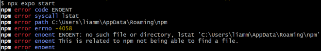
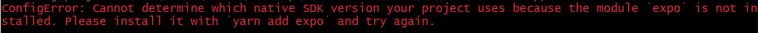

> **I highly encourage viewing this with a markdown previewer (e.g. through VSCode or Bitbucket or the generated docs)**

## Installing and Running:
- Make sure [Node.js (LTS)](https://nodejs.org/en/) is installed
	- Try the following to very (you may need to add Node.js to your **path**):
		- `node -v`
		- `npm -v`
		- `npx -v`
- Running `npx expo start` from inside "mobile-app" will start the app
- **To Run: You can either...**
	1. Download the ***Expo Go*** app on your phone and scan the ***QR code*** <u>(since they want Android, final visual testing should *probably* be through an Android or emulated Android)</u>
	2. Start your simulator from "Android Studio" or "[Orbit](https://expo.dev/orbit)" (would reccommend) and hit `a` in your terminal to launch

## Potential Issues:
*I found these issues by trying to run this project inside a virtual machine. There are possibly other issues you may encounter.*

- 
	- Try: `npm install -g npm@latest`

- 
	- Try: `npm install expo`

## Project Structure (and details):
```text
src/
├─ app/
│  ├─ _layout.tsx          - App entry point, displays index
│  ├─ MessagePage.tsx      - Main page
│  ├─ apiUtils.tsx         - Contains functions that talk to backend
│  ├─ constants.tsx        - For shared values (like the backend url)
│  ├─ styles.tsx           - Contains the styles (might want to refactor)
│  └─ __tests__/           - Houses unit tests
│     ├─ MessagePage.test.tsx
│     └─ apiUtils.test.tsx
├─ assets/                 - Fonts and Images
└─ components/
   ├─ ListItem.tsx         - Component for displaying each post
   ├─ AddPostModal.tsx     - Component for the "Add Post" UI
   └─ __tests__/           - Houses tests
      ├─ ListItem.test.tsx
      └─ AddPostModal.test.tsx
```

## Development Aid:
- **Expo - Guides**
	- https://docs.expo.dev/guides/overview/
- **Expo - Reference**
	- https://docs.expo.dev/versions/latest/
- **React Native - Components Documentation**
	- https://reactnative.dev/docs/components-and-apis
- **React Native Paper - Guides**
	- https://callstack.github.io/react-native-paper/docs/guides/getting-started
- **React Native Paper - Components Documentation**
	- https://callstack.github.io/react-native-paper/docs/components/ActivityIndicator
- **Expo - React/React Native/React Native Paper Live Examples**
	- https://snack.expo.dev/@react-native-paper/react-native-paper-example_v5

## Tests:
- **Recommended VSCode Extension**: "Jest" by Orta
	- Good debugging tool
	- More info: https://www.youtube.com/watch?v=PlppJvJ67GA&ab_channel=MissCoding
- ... or just run tests with `npm test`

## Other:
- This project uses **.tsx (TypeScript with JSX)** files, so I would reccommend familiarizing yourself with **TypeScript** (at leaste a little)
- This project uses **React** and **React Native** as the main skeleton, so I would reccommend familiarizing yourself with those as well
- The backend URL is currently configured to hit a fake api
- For integration testing, this will have to be changed to the dokku URL

## Documentation:
- Since we are using **Expo Go** instead of **Flutter**, we can't use dartdoc for documentation purposes. It has been decided (given that we are using .tsx) that we will use **TypeDoc** for documentation purposes.
- "tsconfig.json" contains the configuration for TypeDoc (including the entry point and output directory) in the "typedocOptions" field.
- To generate documentation, run `npx typedoc`
- The generated documentation will be in the "docs" folder

## Main Commands:
- `npx expo start` - Start the app
- `npm test` - Run tests (I would reccommend using the "Jest" extension in VSCode)
- `npx typedoc` - Generate documentation